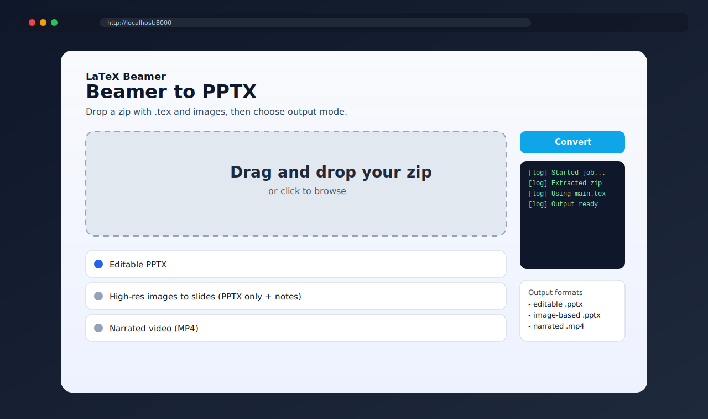
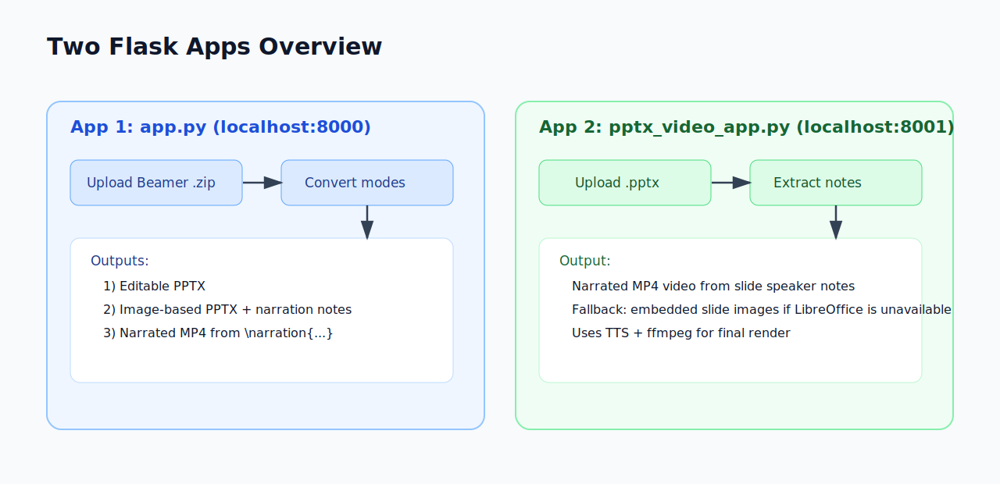

# LaTeX2Video Flask Apps

## What Is Beamer?

Beamer is a LaTeX document class used to create presentation slides (`.tex` files) instead of PowerPoint files. It is popular in academic and technical work because slides are text-based, version-control friendly, and easy to automate.

This project helps bridge Beamer workflows with presentation/video outputs by converting Beamer sources into formats that are easier to share, edit, and narrate.

This repository includes **two Flask apps**:

1. `app.py` (port `8000`): Upload a Beamer `.zip` and convert it to:
- Editable `.pptx`
- Image-based `.pptx` (with notes from `\narration{...}`)
- Narrated `.mp4` video

2. `pptx_video_app.py` (port `8001`): Upload a `.pptx`, read speaker notes, and generate a narrated `.mp4`.

## Screenshots and Flow

### App 1 (`app.py`) - Beamer ZIP Converter



### App 2 (`pptx_video_app.py`) - PPTX Notes to Video


### Combined Architecture / Flow



## Setup

```bash
python3 -m venv .venv
source .venv/bin/activate
pip install -r requirements.txt
```

## Run App 1: Beamer ZIP Converter

```bash
python app.py
```

Open `http://localhost:8000`

Use this when your source is LaTeX Beamer files packaged as a `.zip`.

## Run App 2: PPTX Notes to Video

```bash
python pptx_video_app.py
```

Open `http://localhost:8001`

Use this when you already have a `.pptx` and want a narrated video from slide notes.

## Requirements Notes

- Beamer ZIP app expects a `.zip` containing the main `.tex` and referenced assets.
- If multiple `.tex` files exist, the app prefers a Beamer class file.
- Beamer image/video paths need `latexmk` and `pdftoppm`.
- Video generation needs `ffmpeg`.
- PPTX app uses LibreOffice (`soffice`) + `pdftoppm` for full rendering when available.
- Without LibreOffice, the PPTX app falls back to extracting embedded slide images.
